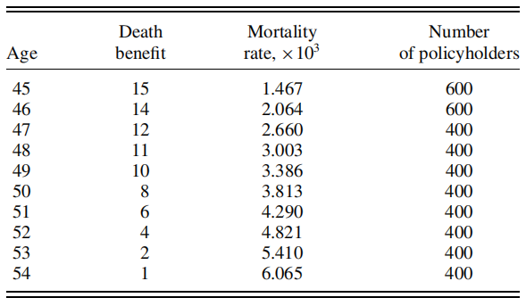

```{r setup, include=FALSE}
knitr::opts_chunk$set(echo = FALSE,message = FALSE,warning = FALSE)
library(ggplot2)
library(knitr)
library(gridExtra)
```

# Fórmula recursiva de Panjer

El objetivo de la fórmula recursiva de Panjer es calcular la densidad exacta de las pérdidas agregadas $S= \sum_{i=1}^N X_i$ del modelo de riesgo colectivo que tiene las siguientes características:

+ $N$ es una v.a. discreta con distribución perteneciente a la clase $(a,b,0)$. 

  _Recordatorio_: La distribución de un v.a. discreta $M$ pertenece a la clase $(a,b,0)$ si $$P(M=m)=\left(a+\frac{b}{m}\right)P(M=m-1)$$ para $m=1,2,3,...$ donde $a,b$ son constantes. Se asume que $P(M=0)>0$. Las distribuciones más conocidas que pertenecen a esta clase son la Poisson, Binomial y Binomial Negativa.
  
+ Las $X_i$'s son v.a.i.i.d. discretas no negativas.

Cuando esto se cumple, entonces 
$$f_S(s) = \frac{1}{1-af_X(0)}\sum_{x=1}^s \left(a+\frac{bx}{s}\right)f_X(x)f_S(s-x)$$
para $s=1,2,...$.

Para $s=0$, $$f_S(0) = P(N=0)$$ si $X_i$ son estrictamente mayores a 0 y $$f_S(0) = \sum_{j=n}^\infty P(N=n)P(X=0)^n$$ cuando $X_i$ toma el valor 0 con probabilidad positiva.

## Algoritmo para implementar la fórmula recursiva de Panjer

**Para el caso en el que $X$ tiene soporte finito:**

- Input: `s` (punto hasta el cual evaluar), `a,b,g0`$=P(S=0)$,`fx` (vector con los valores de la densidad de X)

+ Inicio:
  
  1. Crear el vector `g` para almacenar los valores de $f_S(i), i=0,1,...,s$.
  2. Asignar `g[1]=g0`.
  3. Hacer i=1.
  4. Mientras `i<=1`:
    - `g[i+1]=0`.
    - Para `j` desde 1 hasta el valor mínimo entre el valor máximo que puede tomar $X$ y `s`:
      - `g[i+1]=g[i+1] + (a+b*j/i)* fx[j+1]*g[i-j+1]`.
    - Aumentar `i` en 1.
  
+ Fin. Regresar el vector `g`.

## Implementación

```{r panjer1, echo=TRUE}
#Fórmula recursiva de Panjer para X con soporte finito
panjer <- function(s,a,b,g0,fx){
  g <- rep(NA,s+1)
  g[1] <- g0
  i=1
  while(i<=s) {
    g[i+1] <- 0
    for (j in 1:min(i,length(fx)-1)) {
      g[i+1] <- g[i+1] + (1/(1-a*fx[1]))*(a+b*j/i)* fx[j+1]*g[i+1-j]
    }
  i=i+1
  }
  return(g)
}
```

### Ejemplo 1:

La frecuencia de reclamaciones $N$ sigue una distribución Poisson con media 100, mientras que el monto de cada reclamación solo toma los valores enteros entre 0 y 10 con probabilidad dada por la siguiente tabla:

```{r ej1tab,out.width="50%"}
kable(data.frame(x=0:5,fx=c(0.2212, 0.3064,0.1859,0.1127,0.0684,0.0415),x2=c(6:10,"."),fx2=c(0.0252,0.0153,0.0093,0.0056,0.0087,".")),align = 'c',col.names = c("x","fx","x","fx"))

```
```{r ej1,echo=TRUE}
a <- 0
b <- 100
g0 <- exp(-77.88)
fx <- c(0.2212, 0.3064,0.1859,0.1127,0.0684,0.0415, 0.0252,0.0153,0.0093,0.0056,0.0087)
s <- 250

gs <- panjer(s,a,b,g0,fx)
gs[1:10]
```

```{r ej1plots}
#Gráfica de la función de densidad
d1 <- ggplot(data.frame(x=0:250,fs_x=gs),aes(x=x,y=fs_x)) + geom_point(color="lightgreen") +
  ylab("fs(s)") + ggtitle("Función de densidad de S") +
  theme_minimal() + theme(plot.title = element_text(size=10, face="bold", family = "mono"))

x <- seq(111,251,by=10)
distr_S <- data.frame(s=seq(110,250,by=10),FS_s=sapply(x, function(a){sum(gs[1:a])}))
#Gráfica de la función de distribución
d2 <- ggplot(distr_S,aes(x=s,y=FS_s))+
  geom_point(color="darkgreen") + ylab("FS(s)") + ggtitle("Función de distribución de S") +
  theme_minimal() + theme(plot.title = element_text(size=10, face="bold",family = "mono"))

grid.arrange(d1,d2,ncol=2)
```

**Para el caso en el que $X$ tiene soporte infinito:**

En este caso, solo cambiamos el vector de probabilidades de $X$ (`fx`) por su función de densidad con soporte infinito.

```{r panj2,echo=TRUE}
panjer_f <- function(s,a,b,g0,fX){
  g <- rep(NA,s+1)
  g[1] <- g0
  i=1
  while(i<=s) {
    g[i+1] <- 0
    for (j in 1:i) {
      g[i+1] <- g[i+1] + (1/(1-a*fX(0)))*(a+b*j/i)* fX(j)*g[i+1-j]
    }
    i=i+1
  }
  return(g)
}
```

### Ejemplo 2:

La frecuencia de reclamaciones tiene distribución Poisson con media 2, mientras que el monto de cada reclamación puede tomar cualquier valor entero positivo con probabilidad $f_X(x) = (0.6)(0.4^{x-1}), x=1,2,...$.

```{r ej2, echo=TRUE}
b2 <- 2
(g02 <- dpois(0,2))
f <- function(x){
  if(x>0){
    return(0.6*(0.4^(x-1))) 
  }else{
    return(0)
  }
}
s <- 20

gs2 <- panjer_f(s,a,b2,g02,f)
gs2[1:10]
```

```{r ej2plots}
#Gráfica de la función de densidad
d3 <- ggplot(data.frame(x=0:20,fs_x=gs2),aes(x=x,y=fs_x)) + geom_point(color="lightblue4") +
  ylab("fs(s)") + ggtitle("Función de densidad de S") +
  theme_minimal() + theme_minimal() + theme(plot.title = element_text(size=10, face="bold",family = "mono"))
#Gráfica de la función de distribución
x2 <- seq(1,21)
distr_S2 <- data.frame(s=seq(0,20),FS_s=sapply(x2, function(a){sum(gs2[1:a])}))

d4 <- ggplot(distr_S2,aes(x=s,y=FS_s))+
  geom_point(color="darkblue") + ylab("FS(s)") + ggtitle("Función de distribución de S") +
  theme_minimal() + theme_minimal() + theme(plot.title = element_text(size=10, face="bold",family = "mono"))

grid.arrange(d3,d4,ncol=2)
```

# Fórmula recursiva de De Pril

Esta fórmula sirve para calcular la función densidad de las pérdidas agregadas $S=\sum_{j=1}^n Y_j$ en un modelo de riesgo individual que cumpla con las siguientes características:

+ El portafolio contiene $J$ grupos de riesgo determinados por la probabilidad de reclamación de la póliza. El grupo j tiene probabilidad de reclamación $\theta_j$ para $j=1,2,...,J$.

+ Cada póliza puede tener una suma asegurada de $i\in \{1,2,...,I\}$ unidades monetarias.

+ Tenemos $n_{ij}$ pólizas independientes con suma asegurada (SA) $i$ y probabilidad de reclamo $\theta_j$, para $i=1,2,...I$ y $j=1,2,...,J$.

+ Denotamos como $n=\sum_{i=1}^I\sum_{j=1}^J i\cdot n_{ij}$  al monto máximo de las pérdidas agregadas.

En consecuencia la función de densidad de $S$ para este modelo, denotada como $f_S(s)$, tiene soporte en $\{1,2,...,n\}$.

Para este modelo de riesgo individual, se puede calcular $f_S(s)$ como:

$$f_S(s)=\frac{1}{s}\sum_{i=1}^{min(s,J)}\sum_{k=1}^{[s/i]}f_S(s-ik)h(i,k)$$
para $s=1,2,...,n$ con $$h(i,k)=i(-1)^{k-1}\sum_{j=1}^J n_{ij}\left(\frac{\theta_j}{1-\theta_j}\right)^k$$ para $k=1,2,...,I$ y $h(i,j)=0$ en otro caso.

El valor inicial para esta fórmula recursiva es $$f_S(0)=\prod_{i=1}^I\prod_{j=1}^J (1-\theta_j)^{n_{ij}}.$$

## Implementación

La función recibe `s` (punto hasta el cual evaluar), `n` (matriz de dimensión $I\times J$ con los valores $n_ij$) y `q` (vector de probabilidades $\theta_j$ con longitud $J$). Regresa el vector `fs` que contiene los valores de $f_S(r), r=1,...,s$.

```{r depril, echo=TRUE}
#Función auxiliar
h <- function(i,k,n){
  I <- nrow(n)
  if(i>=1 && i<=I){
    return(i*(-1)^(k-1)*sum(n[i,]*(q/(1-q))^k))
  }else{
    return(0)
  }
}
#Fórmula de De Pril
de_pril <- function(s,n,q){
  I <- nrow(n)
  J <- length(q)
  fs <- rep(NA,s+1)
  fs[1] <- 1
  for (i in 1:I) {
    fs[1] <- fs[1]*prod((1-q)^n[i,])
  }
  r=1
  while(r<=s){
    fs[r+1] <- 0
    for (i in 1:min(r,I)) {
      for (k in 1:floor(r/i)) {
        fs[r+1] <- fs[r+1] + fs[r+1-i*k]*h(i,k,n)
      }
    }
    fs[r+1] <- fs[r+1]/r
    r=r+1
  }
  return(fs)
}
```

### Ejemplo 3:

Un portafolio contiene pólizas separadas en grupos según su suma asegurada que puede ser de 1, 2 o 3 unidades monetarias y su probabilidad de reclamación que puede ser 0.0015, 0.0024, 0.0031, o 0.0088. El número de pólizas de cada grupo y su correspondiente SA y probabilidad de reclamación se muestra en la siguiente tabla:

```{r ej3tab}
n <- matrix(c(30,40,50,60,40,50,70,80,70,60,80,90), nrow = 3,byrow = TRUE)
colnames(n) <- c("j=1","j=2","j=3","j=4"); rownames(n) <- c("SA=1","SA=2","SA=3")
q <- c(0.0015,0.0024,0.0031,0.0088)

kable(n,align = 'c',digits = 0)
q
```
```{r ej3imp,echo=TRUE}
s<-30
fs1 <- de_pril(s,n,q)
#Función de densidad en s=1,...,10
fs1[1:10]
```
```{r ej3plots}
#Gráfica de la función de densidad
d5 <- ggplot(data.frame(x=0:30,fs_x=fs1),aes(x=x,y=fs_x)) + geom_point(color="lightpink") +
  ylab("fs(s)") + ggtitle("Función de densidad de S") +
  theme_minimal() + theme_minimal() + theme(plot.title = element_text(size=10, face="bold",family = "mono"))
#Gráfica de la función de distribución
x<-seq(0,30,by=3)+1
fs_x<-sapply(x, function(a){sum(fs1[1:a])})
d6 <- ggplot(data.frame(x=seq(0,30, by=3),fs_x=fs_x),aes(x=x,y=fs_x)) + geom_point(color="pink3") +
  ylab("Fs(s)") + ggtitle("Función de distribución de S") +
  theme_minimal() + theme(plot.title = element_text(size=10, face="bold", family = "mono"))
grid.arrange(d5,d6,ncol=2)
```

### Ejemplo 4:

La siguiente tabla muestra el número de pólizas de seguro de vida agrupadas según la suma asegurada y la tasa de mortalidad del correspondiente grupo de edad.

```{r ej4tab, fig.align='center',out.width="70%"}
sa <- c(1,2,4,6,8,10,11,12,14,15)
pol <- c(rep(400,8),600,600)
q<-c(6.065,5.410,4.821,4.290,3.813,3.386,3.003,2.660,2.064,1.467)*10^(-3)
n <- matrix(NA,nrow = 15,ncol = 10)
for (i in 1:10) {
  n[sa[i],i] <- pol[i]
}
n[is.na(n)] <- 0


```
```{r ej4imp,echo=TRUE}
#La matriz n contiene ceros en los renglones correspondientes 
# a las sumas aseguradas no definidas.
n
s<-250

f <- de_pril(s,n,q)
#Función de densidad en s=1,...,10
f[1:10]
#Cálculo de la función de distribución.
x <- seq(26,251,by=25)
Fx <- sapply(x, function(a){sum(f[1:a])})

```
```{r ej4plots}
#Gráfica de la función de densidad
d7 <- ggplot(data.frame(x=0:s,fs_x=f),aes(x=x,y=fs_x)) + geom_point(color="violet") +
  ylab("fs(s)") + ggtitle("Función de densidad de S") +
  theme_minimal() + theme_minimal() + theme(plot.title = element_text(size=10, face="bold",family = "mono"))
#Gráfica de la función de distribución
d8 <- ggplot(data.frame(x=seq(25,250, by=25),Fx=Fx),aes(x=x,y=Fx)) + geom_point(color="purple") +
  ylab("Fs(s)") + ggtitle("Función de distribución de S") +
  theme_minimal() + theme(plot.title = element_text(size=10, face="bold", family = "mono"))
grid.arrange(d7,d8,ncol=2)
```

# Método de Kornya

Este método provee una aproximación de la función de densidad de las pérdidas agregadas $S=\sum_{j=1}^n Y_j$ para un modelo de riesgo individual con las mismas características que se requieren para usar la fórmula de De Pril. Usando la notación de la sección anterior, la aproximación de Kornya es:
$$g_S^{(K)}(s)=\frac{1}{s}\sum_{j=1}^{min(x,IK)}jb_j^{(K)}g_S^{(K)}(s-j)$$ 
donde 
$$b_x^{(K)} = \sum_{k=\{x/I\},k|x}^{min(K,x)}\frac{(-1)^{(k+1)}}{k}\sum_{j=1}^J n_{x/k,j}\left(\frac{\theta_j}{1-\theta_j}\right)^k$$, $$g_S^{(K)}(0) = \exp{(b_0^{(K)})}$$ y $$b_0^{(K)} = \sum_{k=1}^K\frac{(-1)^{k}}{k}\sum_{i=1}^I \sum_{j=1}^J n_{ij}\left(\frac{\theta_j}{1-\theta_j}\right)^k$$
Mientras mayor sea $K$ mejor será la aproximación de $g_S^{(K)}(s)$ a $f_S(s)$, sin embargo, con $K=4$ ya suele tenerse una aproximación suficientemente buena.

## Implementación

La función `kornya()` recibe el punto `s` hasta el cual se calcula la aproximación, el grado `K` de aproximación, la matrix `n` con los grupos de pólizas y el vector de probabilidades de reclamación `q`; estos dos últimos definidos de igual manera que para la función de `de_pril`.

```{r kornya, echo=TRUE}
#Función auxiliar
b <- function(x,K,I,J){
  if(x==0){
    bx <- 0
    for (k in 1:K) {
      for (i in 1:I) {
        bx <- bx + ((-1)^k/k)*sum(n[i,]*(q/(1-q))^k)
      }
    }
  }else{
    k <- seq(floor(x/I) + 1,min(x,K))
    k <- subset(k,x%%k==0)
    bx <- 0
    for(i in k){
      bx <- bx + (((-1)^(i+1))/i)*sum(n[x/i,]*(q/(1-q))^i)
    } 
  }
 return(bx) 
}
# Fórmula de Kornya
kornya <- function(s,K,n,q){
  I <- nrow(n)
  J <- ncol(n)
  d <- rep(NA,s+1)
  d[1] <- exp(b(0,K,I,J))
  m=1
  while (m<=s) {
    d[m+1] <- 0
    for (j in 1:min(m,I*K)) {
      d[m+1] <- d[m+1] + j*b(j,K,I,J)*d[m+1-j]
    }
    d[m+1] <- d[m+1]/m
    m=m+1
  }
  return(d)
}

```

### Ejemplo 5

Usando el mismo plantemiento del Ejemplo 4.

```{r ej5, echo=TRUE}
s<-250
#Con K=2
kor <- kornya(s,2,n,q)
x <- seq(26,251,by=25)
Fx_K2 <- sapply(x, function(a){sum(kor[1:a])})
#Aproximación de la función de densidad en s=1,...,10
kor[1:10]
```
```{r ej5plots}
#Gráfica de la función de densidad
d9 <- ggplot(data.frame(x=0:s,fs_K=kor),aes(x=x,y=fs_K)) + geom_point(color="orange") +
  ylab("fs(s)") + ggtitle("Aprox. función de densidad de S") +
  theme_minimal() + theme_minimal() + theme(plot.title = element_text(size=10, face="bold",family = "mono"))
#Gráfica de la función de distribución
d10 <- ggplot(data.frame(x=seq(25,250, by=25),Fs_K2=Fx_K2),aes(x=x,y=Fs_K2)) + geom_point(color="orange3") +
  ylab("Fs(s)") + ggtitle("Aprox. función de distribución") +
  theme_minimal() + theme(plot.title = element_text(size=10, face="bold", family = "mono"))
grid.arrange(d9,d10,ncol=2)
```
